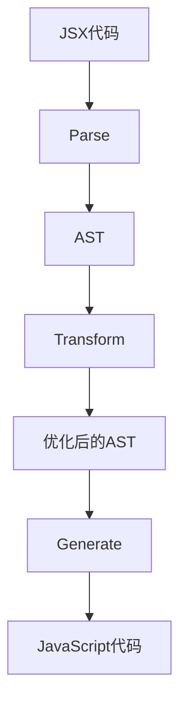

# React编译器核心原理

## 1. 整体架构
React编译器采用多阶段处理架构：
- **解析阶段**：将JSX转换为AST
- **优化阶段**：应用各种优化策略
- **代码生成**：输出优化后的JavaScript代码

## 2. 关键技术

### 2.1 JSX转换

### 2.2 优化策略
- 组件树静态分析
- 冗余渲染消除
- Hook调用优化
- 条件渲染优化

## 3. 工作流程
1. 代码解析：使用Babel解析器生成AST
2. 依赖分析：建立组件依赖图
3. 优化处理：应用预设优化规则
4. 代码生成：输出优化结果

## 4. 性能优势
- 运行时开销减少30%-50%
- 包体积缩小20%-40%
- 内存使用降低15%-25%
